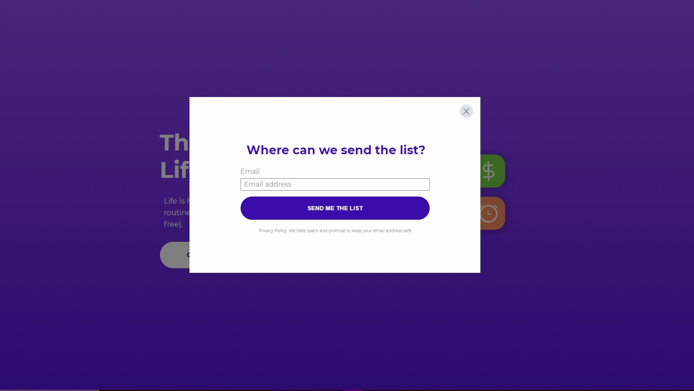
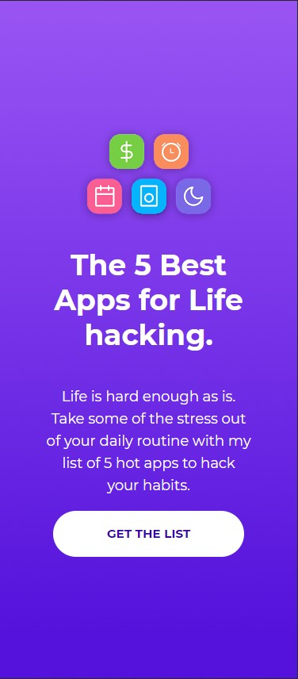
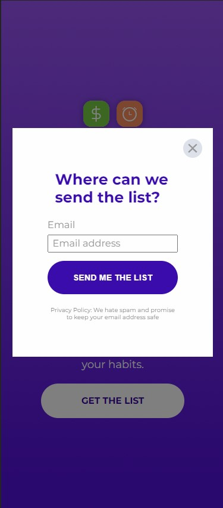

# Top 5 Best Apps Landing Page Clone<!-- omit in toc -->

This is a clone of one of the Templates featured on leadpages.com.

## Version 1.0<!-- omit in toc -->

- **Project Start:** August 25, 2021
- **Project End:** August 29, 2021

# CONTENTS
- [CONTENTS](#contents)
  - [Introduction](#introduction)
  - [Screenshots](#screenshots)
      - [Desktop](#desktop)
      - [Mobile](#mobile)
  - [Methodology](#methodology)
  - [Tools I Used](#tools-i-used)
  - [What I learned](#what-i-learned)
    - [Tricky points](#tricky-points)
  - [Items for further study](#items-for-further-study)
  - [Helpful Resources](#helpful-resources)
  - [About me](#about-me)
 

Introduction
---
In the interest of getting more practice in creating landing pages, I thought it would be good to clone an existing landing page to get a feel for how it's set up, structured, etc.

The original design on leadpages can be found here: https://www.leadpages.com/templates/preview/KcvneBMTimR3TctzSbtVcX

 

Screenshots
---

#### Desktop

#### Mobile

 

Methodology
---
First, I opened up my Browser's Dev Tools to take a look at some of the basic stylings used in the template. 

After scaffolding the layout in HTML, I got to work trying to tweak the styling in CSS. 

I worked on the Scripting last, as there were several techniques that I wasn't fully familiar with and had to look up.

 

Tools I Used
---
- HTML
- CSS
- JavaScript ES6
- Mobile-First design

 

What I learned
---
Only had a handful of experience with RegExp. The original Template didn't use the Form validation that I was familiar with (where a popup is displayed if you leave a field empty or the value entered is invalid). 

### Tricky points
One of the major challenges was the animation on the Modal Dialog box. When it appears, it fades in and up, and when the user clicks on the exit button or clicks outside the Dialog box, the box fades away and descends until it disappears. Read up on what to do [on w3 Resource](https://www.w3resource.com/javascript/form/email-validation.php).

In additions, scrolling was disabled while the Modal Dialog was on screen.

So, my challenge was two-fold: 
- How do I prevent the user's ability to scroll the page while the dialog is up?
- How do animate the Modal Dialog when it comes in, and when the user exits?

I found a solution for the animation on [Stack Overflow here](
https://stackoverflow.com/questions/45604025/how-to-get-fade-in-out-modal-effect), and the solution to my scrolling dilemma [was found here](https://stackoverflow.com/questions/9538868/prevent-body-from-scrolling-when-a-modal-is-opened).

 

Items for further study
---

Now that I have an idea on how to animate Modal Dialog boxes, I want more chances to use it more. Also, I'd like to try different animations besides fade-in/fade-out. (Like zoom in from the sides and swinging when it comes to a stop).

 

Helpful Resources
---
- [JavaScript: HTML Form - email validation](https://www.w3resource.com/javascript/form/email-validation.php): information on email address validation

- [Prevent BODY from scrolling when a modal is opened](https://stackoverflow.com/questions/9538868/prevent-body-from-scrolling-when-a-modal-is-opened): gave me an idea on how to prevent scrolling on the body when the modal was open

- [How to get Fade-in-out modal effect?](https://stackoverflow.com/questions/45604025/how-to-get-fade-in-out-modal-effect): looking at the solution gave me an idea on how to animate the Modal 

About me
---

Thanks for checking out this project! 😃 You can find my profiles at these sites:
- [Personal Portfolio](https://www.sonjigoodman.com)
- [Twitter: @IT_Sonji](https://twitter.com/sonji_it)
- [Frontend Mentor - @infinity-Mineeva](https://www.frontendmentor.io/profile/Infinity-Mineeva)
